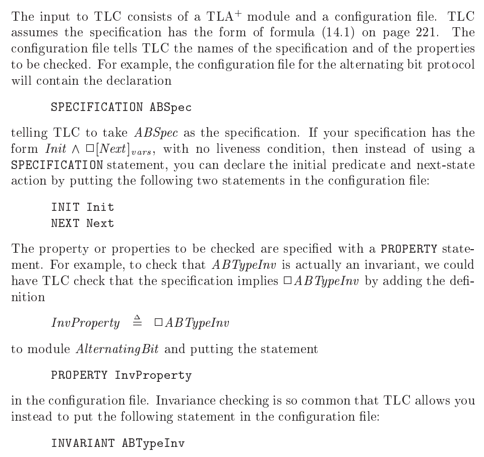

# Approaching TLA+ from the CLI

This doc describes my attempt (in 2019-12) to ramp up on TLA+ without reliance
on the TLA+ IDE. This was inspired by [this
tweet](https://twitter.com/hillelogram/status/1207874445823623168).

# My background and expectations

I am a Google software engineer and Mathematics PhD. I have professional
experience working with dozens of languages and frameworks, and at the time of
this writing most my professional work is in Java or Python. My PhD was in the
theory of computer science. There was a time in my life when I used IDEs
primarily, have extensively used tools like Eclipse, PyCharm, Jupyter, etc.,
but today I do all my work in vim.

I like my tools to be straightforward and easy to separate. For example, when
creating a new Python project I work in an isolated directory, and create a
separate virtual environment and requirements file dedicated to the project. I
write a math blog where each topic receives its own Github repository (over a
hundred to date), and it's important that I can remove these from my machine
and recreate them from scratch at any time.

I also like to have my build, test, and run functionality accessible on the
command line, and for those tools to be easily inspectable. I.e., where do they
expect files to be, what naming conventions do they enforce, and what files do
they create and where? Can I specify it myself via flags? What is the meaning
of each tool's output, so that when things go wrong I can interpret the error
messages and learn where the problem is and how to fix it? Do these tools
follow the same sorts of expectations that allow me to plug in other tools (via
shell piping, for example)?

All of these issues point to a single principle that guides me when it comes to
tools and software: self-reliance. My tools should limit, to the greatest
extent possible, forcing my reliance on a particular method of operating with
it. If I can't understand the organization of a system broadly, or if I can't
easily drill down on a particular component when it is causing problems, then
it's a guaranteed future problem.

Though it cannot always be avoided, I enjoy using tools that empower me to be
more self-reliant over tools that violate it.

# Setting up

```
mkdir ~/prototypes/tla
cd ~/prototypes/tla
git it   # alias for !git init && git commit -m "root" --allow-empty
git remote add origin git@github.com:j2kun/tla_cli.git
git push -u origin master
```

I expect each significant TLA+ project to get its own git repository.

# Hello Lamport

Now I need to find a "hello world" specification to write, build, and model
check. Here is where things start to diverge. I went through three different
sources. First, Leslie Lamport's video tutorial, which I'll put into a
subdirectory of this repository called `hello_lamport`.

Even this has some confusion. Lamport's [video
course](http://lamport.azurewebsites.net/video/videos.html) (whose style I
adore) has one "hello world", while his book [Specifying
Systems](https://lamport.azurewebsites.net/tla/book.html) has a different
"hello world" based on an hour clock.

From the video lecture (end of lecture 2), the "add one" specification.

```tla
--------------- MODULE SimpleProgram ---------------
EXTENDS Integers
VARIABLES i, pc
Init == (pc = "start") /\ (i = 0)
Next == \/ /\ pc = "start"
           /\ i’ \in 0..1000
           /\ pc’ = "middle"
        \/ /\ pc = "middle"
           /\ i’ = i + 1
           /\ pc’ = "done"
====================================================
```

And from the book, a simple hour clock.

```tla
---------------------- MODULE HourClock ----------------------
EXTENDS Naturals
VARIABLE hr
HCini == hr \in (1 .. 12)
HCnxt == hr' = IF hr # 12 THEN hr + 1 ELSE 1
HC == HCini /\ [][HCnxt]_hr
--------------------------------------------------------------
THEOREM HC => []HCini
==============================================================
```

I saved these to the files `add_one.tla` and `hour_clock.tla`, respectively.

I will avoid commenting on the syntax while we focus on getting one of these
specifications to compile, run, and model check. At this point, it's not clear
which of these is even complete. For instance, one has a "theorem" block and
one does not.

We are already at somewhat of an impasse. Specifying Systems provides no
explanation for how to compile or run the model checker on the simple clock,
and the video lectures walk you through using the user interface. We'll get
back to the UI later, but for now let's see if we can't find another resource
explaining how to do it without the UI.

Looking around the TLA+ website I find a reference to the "TLA Hyperbook,"
which is a book composed of a bunch of pdf files with hyperlinks between them
(which, as you might expect, behaves strangely depending on the pdf reader
you're using). The hello world example in this book is a "one bit clock", but
the book only tells you what buttons to click in the UI to parse and run the
model check.

Then there is [this pdf](https://lamport.azurewebsites.net/tla/current-tools.pdf)
explaining the "current versions of the tools" as of 2018, and confusingly claims

> The book and this document [about "TLA+ tools"] do not describe the features
> provided by the TLA+ Toolbox for using the tools.

Then the hyperlink to the "TLA+ Toolbox" is a link to Lamport's C drive.
Anyhow, the pdf contains four sections, for tools called `SANY`, `TLC`,
`TLALATEX`, and `PlusCal`.

The section on `SANY` simply says, "The current release of SANY has no known
limitations." Great. It also has no known purpose or features. The rest of the
file appears to be relese notes showing what has changed about the command line
tools (so there are CLI tools!) since Specifying Systems was published.

Finally I find [this
page](https://lamport.azurewebsites.net/tla/standalone-tools.html) for running
the TLA+ tools "standalone." There is a link to a [Github release
page.](https://github.com/tlaplus/tlaplus/releases/tag/v1.6.0) Now we're
getting somewhere. The instructions on that page ask you to download a zip
containing a JAR file (Java archive), set up a CLASSPATH to point to it, and
then run the scripts via the Java command:

```
java tlc2.TLC
java tla2sany.SANY
java pcal.trans
java tla2tex.TLA
```

Knowing Java well enough, I can use the `-cp` flag on the `java` CLI to set a
classpath per invocation, and I don't want to modify my system (in the interest
of locality of this project's setup). So installing the CLI tools (finally) is
as simple as

```bash
wget https://github.com/tlaplus/tlaplus/releases/download/v1.6.0/tla2tools.jar
java -cp tla2tools.jar tlc2.TLC
```

I get:

```
TLC2 Version 2.14 of 10 July 2019 (rev: 0cae24f)
Error: Error: Missing input TLA+ module.
Usage: java tlc2.TLC [-option] inputfile
```

Excellent! Except---I still don't know what the hell these four commands do.
`tla2tex` is self-evident, but SANY is still a mystery (I guess it's a parser?)
And TLC2 is presumably the model checker. `pcal.trans` is who knows what
(Googling shows it's a language that compiles to TLA, somehow through writing
code in comment blocks of normal TLA files?).

Some more false starts:

```
$ java -cp tla2tools.jar tlc2.TLC --help
TLC2 Version 2.14 of 10 July 2019 (rev: 0cae24f)
Error: Error: unrecognized option: --help
Usage: java tlc2.TLC [-option] inputfile
```

Remembering (or realizing now) that TLC is written on top of Java, the long
switches are probably single-hyphen.

```
$ java -cp tla2tools.jar tlc2.TLC -help
TLC2 Version 2.14 of 10 July 2019 (rev: 0cae24f)
The model checker (TLC) provides the functionalities of model
checking or simulation of TLA+ specifications. The syntax for this command is:

java tlc2.TLC [GENERAL-SWITCHES] [MODE-SWITCHES] SPEC

where SPEC is the name of the specification's root module
and the optional GENERAL-SWITCHES are:
-checkpoint num: interval between check point (in minutes)
	Defaults 30 if not provided.
-cleanup: clean up the states directory
-config file: provide the config file.
	Defaults to SPEC.cfg if not provided
...

By default, TLC starts in the model checking mode using breadth-first
approach for the state space exploration. This can be changed using
the MODE-SWITCHES. In contrast to the GENERAL-SWITCHES these can be used
if applied in certain combinations only:

{[-dfid num][ -view]|-simulate[ -depth num][ -aril num][ -seed num]}

-modelcheck: run in model checking mode using breadth-first approach for the
	state space exploration (default)
...
```

Great! Let's run it on the `add_one` spec I wrote.

```bash
$ java -cp tla2tools.jar tlc2.TLC hello_lamport/add_one.tla
TLC2 Version 2.14 of 10 July 2019 (rev: 0cae24f)
Warning: Please run the Java VM which executes TLC with a throughput optimized garbage collector by passing the "-XX:+UseParallelGC" property.
(Use the -nowarning option to disable this warning.)
Running breadth-first search Model-Checking with fp 101 and seed 6345125587550240554 with 1 worker on 4 cores with 2048MB heap and 64MB offheap memory [pid: 97903] (Mac OS X 10.14.6 x86_64, Oracle Corporation 10.0.1 x86_64, MSBDiskFPSet, DiskStateQueue).
Error: TLC threw an unexpected exception.
This was probably caused by an error in the spec or model.
See the User Output or TLC Console for clues to what happened.
The exception was a tlc2.tool.ConfigFileException
: TLC encountered the following error when trying to read the configuration file hello_lamport/add_one.cfg:
File not found.
Finished in 00s at (2019-12-23 09:54:40)
```

OK, that's quite a bit of junk (version string, timing information, random
diagnostics), so if I ever need to pipe this to some other command it'll be
annoying. But the bigger problem is that it failed. It's looking for a config
file that I didn't know needed to exist (it's not mentioned in any of the
aforementioned resources). What should be in this config file? What is the format?

Googling around shows [this page from the UI
designers](https://tla.msr-inria.inria.fr/tlatoolbox/doc/model/executing-tlc.html#MC)
that doesn't help. Then this [github
issue](https://github.com/tlaplus/Examples/issues/6) that says, "Let the UI do
it for you." One [helpful
comment](https://github.com/tlaplus/Examples/issues/6#issuecomment-415307340)
explains the reason for their existence: the model spec is "infinite-state" and
the onfig file specifies the parameters of a particular instantiation of the
model to check.

Then this [google group
thread](https://groups.google.com/forum/#!topic/tlaplus/IBpkSU_rgng) that
points to Chapter 14 of Specifying Systems. Chapter 14 starts by saying it's
describing tools that are out of date. Then it describes some very brief
information about what can go in a config file.



Here it seems to say that the syntax should look like this

```
SPECIFICATION foo
```

Or by manually putting in an init and next state (if there's not a liveness
condition in the spec, which, again, because this is a hello world, I dont
understand). That alternative might look like

```
INIT foo
NEXT bar
```

Luckily add_one does look like that, so my cfg, now in `add_one.cfg` is

```
INIT Init
NEXT Next
```

Running it:

```bash
$ java -cp tla2tools.jar tlc2.TLC hello_lamport/add_one.tla
TLC2 Version 2.14 of 10 July 2019 (rev: 0cae24f)
Warning: Please run the Java VM which executes TLC with a throughput optimized garbage collector by passing the "-XX:+UseParallelGC" property.
(Use the -nowarning option to disable this warning.)
Running breadth-first search Model-Checking with fp 96 and seed -6157446468698750503 with 1 worker on 4 cores with 2048MB heap and 64MB offheap memory [pid: 99881] (Mac OS X 10.14.6 x86_64, Oracle Corporation 10.0.1 x86_64, MSBDiskFPSet, DiskStateQueue).
Parsing file /Users/jeremy/prototypes/tla/hello_lamport/add_one.tla
Lexical error at line 6, column 16.  Encountered: "\u2019" (8217), after : ""

Fatal errors while parsing TLA+ spec in file hello_lamport/add_one

tla2sany.semantic.AbortException
*** Abort messages: 1

In module add_one

Could not parse module add_one from file hello_lamport/add_one.tla

Starting... (2019-12-23 10:24:21)
Error: Parsing or semantic analysis failed.
Finished in 01s at (2019-12-23 10:24:21)
```

The `u2019` unicode issue turns out to be because copying the model spec from
Lamport's website retains the curliness of the quote, instead of using ascii
quotes. Fine, easy fix. The bigger problem seems to be that it can't parse the
contents. After a while I realize that the name of the module needs to be
identical with the name of the file. It goes unnoticed and unremarked on
because the UI forces it.

Round three:

```bash
$ java -cp tla2tools.jar tlc2.TLC hello_lamport/add_one.tla
TLC2 Version 2.14 of 10 July 2019 (rev: 0cae24f)
Warning: Please run the Java VM which executes TLC with a throughput optimized garbage collector by passing the "-XX:+UseParallelGC" property.
(Use the -nowarning option to disable this warning.)
Running breadth-first search Model-Checking with fp 48 and seed -1739863346183740757 with 1 worker on 4 cores with 2048MB heap and 64MB offheap memory [pid: 1018] (Mac OS X 10.14.6 x86_64, Oracle Corporation 10.0.1 x86_64, MSBDiskFPSet, DiskStateQueue).
Parsing file /Users/jeremy/prototypes/tla/hello_lamport/add_one.tla
Parsing file /private/var/folders/k2/xw116qj50n96tn37lvfc6rrm0000gn/T/Integers.tla
Parsing file /private/var/folders/k2/xw116qj50n96tn37lvfc6rrm0000gn/T/Naturals.tla
Semantic processing of module Naturals
Semantic processing of module Integers
Semantic processing of module add_one
Starting... (2019-12-23 10:28:05)
Error: TLC threw an unexpected exception.
This was probably caused by an error in the spec or model.
See the User Output or TLC Console for clues to what happened.
The exception was a java.lang.NullPointerException
java.lang.NullPointerException
	at tlc2.tool.impl.SpecProcessor.processSpec(SpecProcessor.java:346)
	at tlc2.tool.impl.SpecProcessor.<init>(SpecProcessor.java:157)
	at tlc2.tool.impl.Spec.<init>(Spec.java:121)
	at tlc2.tool.impl.Tool.<init>(Tool.java:126)
	at tlc2.tool.impl.Tool.<init>(Tool.java:121)
	at tlc2.tool.impl.Tool.<init>(Tool.java:116)
	at tlc2.TLC.process(TLC.java:930)
	at tlc2.TLC.main(TLC.java:247)

Finished in 01s at (2019-12-23 10:28:05)
```

Now I really don't know what the hell is going on. I'll have to dig into the
source code to determine.  This is especially strange because running `SANY`,
which I expect to be some kind of parser, on the same file, reports no errors.

```bash
$ java -cp tla2tools.jar tla2sany.SANY hello_lamport/add_one.tla

****** SANY2 Version 2.1 created 24 February 2014

Parsing file /Users/jeremy/prototypes/tla/hello_lamport/add_one.tla
Parsing file /private/var/folders/k2/xw116qj50n96tn37lvfc6rrm0000gn/T/Integers.tla
Parsing file /private/var/folders/k2/xw116qj50n96tn37lvfc6rrm0000gn/T/Naturals.tla
Semantic processing of module Naturals
Semantic processing of module Integers
Semantic processing of module add_one
```

Looking at `hour_clock.tla`, I guess that maybe because I don't have a
`THEOREM` TLC doesn't know what to do? But I'm not sure how to add a theorem
block to the config file. It's not an INVARIANT, PROPERTY, or CONSTRAINT, none
of which I understand yet, but those are the ones that Chapter 14 of Specifying
Systems says can go in a config file. Same NPE happens when I try random stuff.

# Looking around

At this point I randomly search the internet for resources. That turned up a
Medium
[article](https://medium.com/@bellmar/introduction-to-tla-model-checking-in-the-command-line-c6871700a6a2)
by Marianne Bellotti, who seems to agree with me that the UI is not ideal and
has a workaround to use CLI tools. This only repeats what I already figured
out, that it's a Java application you can wrap with some default flags and
bashisms (copied
[here](https://github.com/j2kun/tla_scratchwork/blob/master/scripts/tlc) to its
own script).

Then I find myself reading through the TLA Toolbox developers Github issues
(like [this one](https://github.com/tlaplus/tlaplus/issues/140)) and I learn
that the project is just as confusing for everyone else as it is for me. It's
not organized well to use with version control, people aren't sure what files
to keep and what to ditch, and there is something called a `.launch` file,
which it's not clear if the UI owns that, or what. Also apparently the codebase
is somewhat coupled with the Eclipse IDE it was written in, which is a bad
sign. This is all frustrating (though I did learn that [elasticsearch uses
TLA](https://github.com/elastic/elasticsearch-formal-models), cool!), and I
wonder why they can't just make the system simpler rather than add layers on
top of it reacting to dev confusion. I can't honestly believe that the TLC
system is so complex from an organizational standpoint that this can't be
done.

# Hello UI

Now I attempt to use the UI for the same problem. The UI takes my `add_one` and
creates `add_one.toolbox/add_one_model/` which contains `MC.tla` and `MC.cfg`.
The former apparently just extends from my existing spec, and the latter looks
just like my cfg file I made by hand, modulo whitespace. This doesn't help my
confusion, though I can run the model checker in the UI. Maybe `MC` is a
reserved word that needs to be there? Some other places on the internet seem to
hard code that name. Or maybe I just didn't pass the right CLI flags.

# Impressions

There's a lot of irony here. TLA+ is designed to help engineers specify tricky systems in which outcomes may not always be as expected because execution paths will be complicated enough that an
